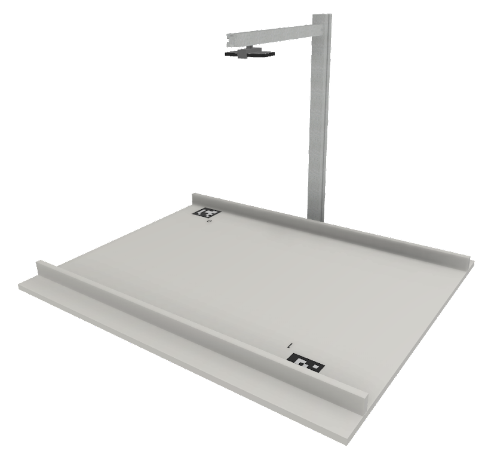
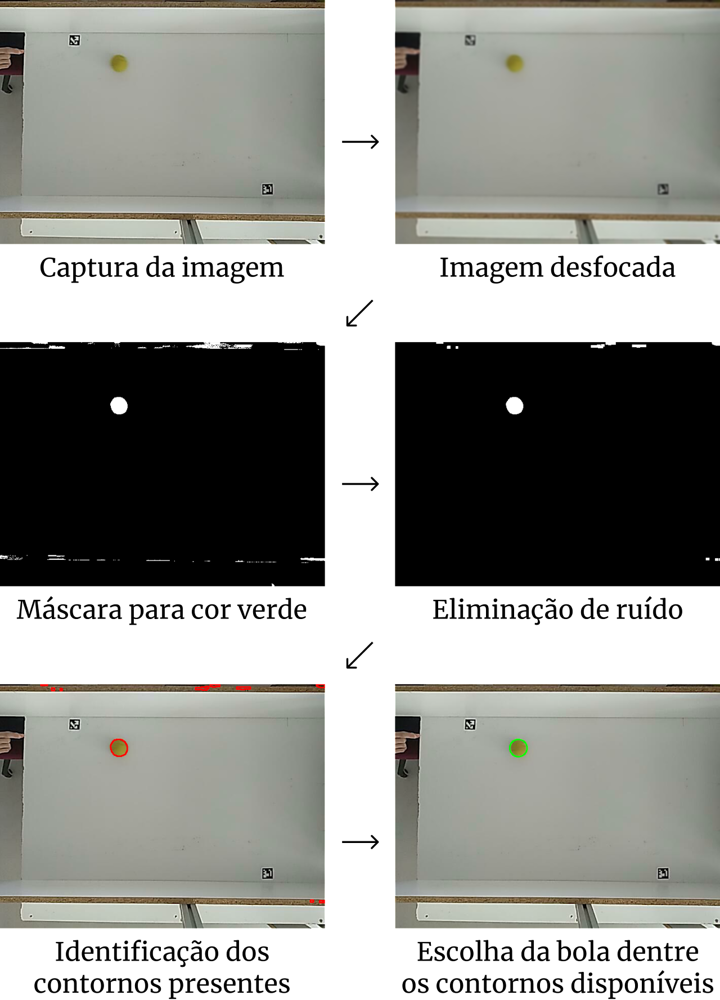

# PIP-PRoS: Plataforma Robótica Sensorizada

O jogo Pong como ferramenta para o aprendizado de Visão Computacional e Robótica


## Sobre
Dentro do âmbito do Projeto de Inovação Pedagógica (PIP 2022), o PRoS foi criado, ao combinar Visão Computacional e Robótica para o ensino dessas cadeiras no ambiente universitário.

Ao partir do conhecido vídeo-jogo Pong, o projeto tem como objetivo o desenvolvimento de um setup experimental que permita a uma pessoa jogar contra um robô.

O setup pode servir para teste de diversas funcionalidades nas áreas da Visão Computacional e Robótica, podendo ser inserido em trabalhos de laboratório de ambas as Unidades Curriculares. As diferentes componentes do jogo são disponibilizadas aos estudantes do IST, e ao público em geral neste repositório e por meio [deste link](https://sites.google.com/tecnico.ulisboa.pt/pip-pros/home).


## Etapas do projeto

O projeto é dividido nas seguintes etapas, que podem ser vistas em detalhe ao clicar nos links:

1. [Criação do setup](https://sites.google.com/tecnico.ulisboa.pt/pip-pros/etapas/setup-sugerido)

    

1. [Identificação do campo](https://sites.google.com/tecnico.ulisboa.pt/pip-pros/etapas/identifica%C3%A7%C3%A3o-do-campo)

    

1. [Detecção da bola](https://sites.google.com/tecnico.ulisboa.pt/pip-pros/etapas/detec%C3%A7%C3%A3o-da-bola)

    

1. [Predição da trajetória da bola](https://sites.google.com/tecnico.ulisboa.pt/pip-pros/etapas/predi%C3%A7%C3%A3o-da-trajet%C3%B3ria)

    

1. [Controlo do robô](https://sites.google.com/tecnico.ulisboa.pt/pip-pros/etapas/controlo-do-rob%C3%B4)

## Instalação

Para replicar o projeto, as instruções de instalação podem ser encontradas [aqui](https://sites.google.com/tecnico.ulisboa.pt/pip-pros/instala%C3%A7%C3%A3o-e-personaliza%C3%A7%C3%A3o).

## Execução do código

Create the virtual env:

``` bash
python -m venv ./venv
```

Activate the virtual env:
``` bash
.\venv\Scripts\activate
```

In the first time, install the requirements:
``` bash
pip install -r .\requirements.txt
```

Run the python file:
``` bash
python ./refactoring_cv/main.py
```


## Contato

João Sequeira (joao.silva.sequeira@tecnico.ulisboa.pt)

Manuel Marques (manuel.marques@tecnico.ulisboa.pt)

João Paulo Costeira (jpc@isr.tecnico.ulisboa.pt)

Murillo Teixeira (murillo.teixeira@tecnico.ulisboa.pt)